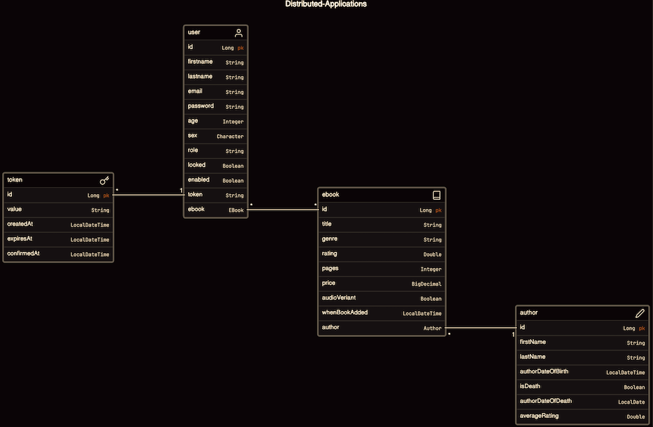

# Distributed-Application (OLP) 
## Online Library Project

### Description
 - OnlineLibrary is a web application designed to manage a digital library, 
allowing users to register, authenticate, and perform various operations 
on electronic-books (ebooks). The project utilizes token-based authentication 
for user registration and login, providing a secure environment for managing 
user-specific data.

### Features
### 1. User Registration
- When users register for the Online Library for the first time, 
they must provide personal information. Once they submit their details, 
the system validates the information. If the provided information is valid, 
users receive a unique verification code via email. 
This code serves to verify their identity. After verification, 
users can log in using Basic Authentication.

### 2. EBook Management
- CRUD operations (Create, Read, Update, Delete) for ebooks are supported. 
Only administrators can add new books, update existing ones, delete unwanted 
entries. All users can view the entire ebook collection and borrow all kinds 
of ebooks to read. Each user, personal reading list is kept to themselves only.

### 3. User-EBook Relationship
- EBooks have a many-to-many relationship with app users, allowing users to 
own and manage their ebook collections.

### 4. Authors
- CRUD operations (Create, Read, Update, Delete) for authors are supported.
Only administrators have permission to add new authors, update their 
information, and delete existing ones. However, all users can view 
the list of authors available in the Online Library and explore details 
about their favorite authors.

### 5. EBook-Author Relationship
- EBooks have a many-to-one relationship with authors. 
This design reflects the fact that several books could be written by 
the same author, but a book cannot have multiple authors.

- Before adding a new ebook to the library, each book must be 
associated with its corresponding author; otherwise, the ebook will not be saved.

### Technologies used
#### 1. Development
- Spring Boot (2.7.12)
- JDK (11.0.18)
- Spring Security
- Hibernate
- RESTful API
- Lombok
- Postgres

### 2. Testing
- Postman 
- JUnit Test (would be implemented, shortly)

### 3. Documentation
- Swagger (springfox-swagger2) (API: v2/api-docs)

### Project Diagram of DB

